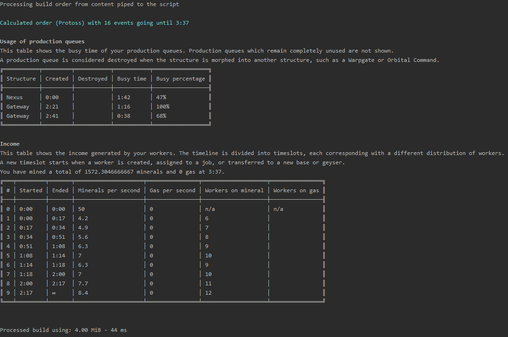

#sc2calc library

Build order timing calculator library for SC2 written in PHP

This is a rewrite based on [sc2calc.org](http://sc2calc.org)

Currently this only works with old WOL builds because all the game data has not been updated yet.
## Why?

I was always interested in the old build order calculator on [sc2calc.org](http://sc2calc.org). It seemed like a cool tool to work with.
When I decided to give updating it a shot I realised how old of a web application it was and how much that showed.
So instead I opted to rewrite the calculator logic from the old application and sever it from the connected html rendering and 
in doing so offer the functionality in the form of a library.

This calculator can still be used as a standalone tool using the command line script provided as a vendor binary.
## Installation
The preferred / only way to install the library is via composer:

`composer require holonet/sc2calc`

or update your `composer.json`

```
    ...
    "require": {
        "holonet/sc2calc": "~1.0"
    },
    ...
```

## How to use

#### As a library:
```php
<?php

require __DIR__ . '/vendor/autoload.php';

$order = <<<BUILD
10 Supply Depot
12 Barracks
14 Refinery, then put 3 SCVs on gas (2 seconds)
16 Orbital Command, then constant Calldown: MULE
17 Barracks, then Tech Lab on Barracks, then Stimpack
18 Barracks, then Reactor on Barracks
BUILD;

$sc2calc = new \holonet\sc2calc\Sc2Calc();
//build object containing the calculated timeline with all events
$build = $sc2calc->fromBuildOrderString($order);
```

#### From the command line:

`cat mothershiprush.txt | php vendor/bin/sc2calc`

This will print production queues and income data to the cmd line such as:



The command line vendor binary has a bunch of useful options.
Run ``php vendor/bin/sc2calc --help`` to see them all. 

## TODO
- update data packs to LOTV, add new units and structures
- read / write to other build order string formats such as SALT encoding
- more structural reformatting, making the code more readable

## Contributor's guide
If you with to contribute to the library you can just fork it on github and eventually send me a pull request.

You don't even necessarily have to write any code to contribute, as the main component of the calculator are the data pack files 
in the ``data/`` subdirectory which are simple json files.

If you want to "train" the library it is best to use the command line script while supplying the `--debug` flag:

`cat dev_build.txt | php vendor/bin/sc2calc --debug`

This will print an extensive debugging trace as to what the library is doing.

If you use a build to fix a bug or proofrun a json data change, it would be preferable if you eventually put it into the 
``tests/orders/`` subdirectory where it will automatically be run as a phpunit test.

In development, I use code quality assurance tools such as php-cs-fixer and psalm. If you contributed a change you can
run ``composer test`` to automatically test your code.
